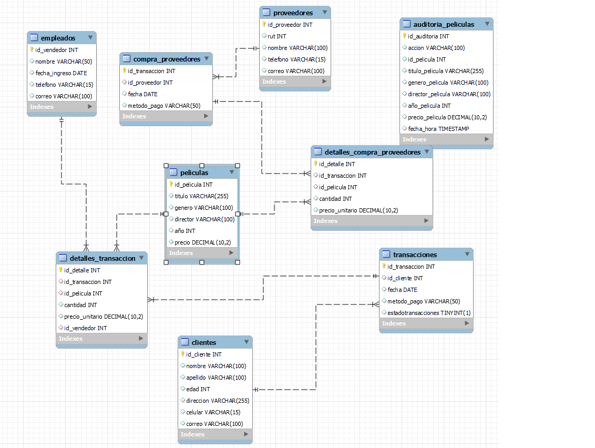
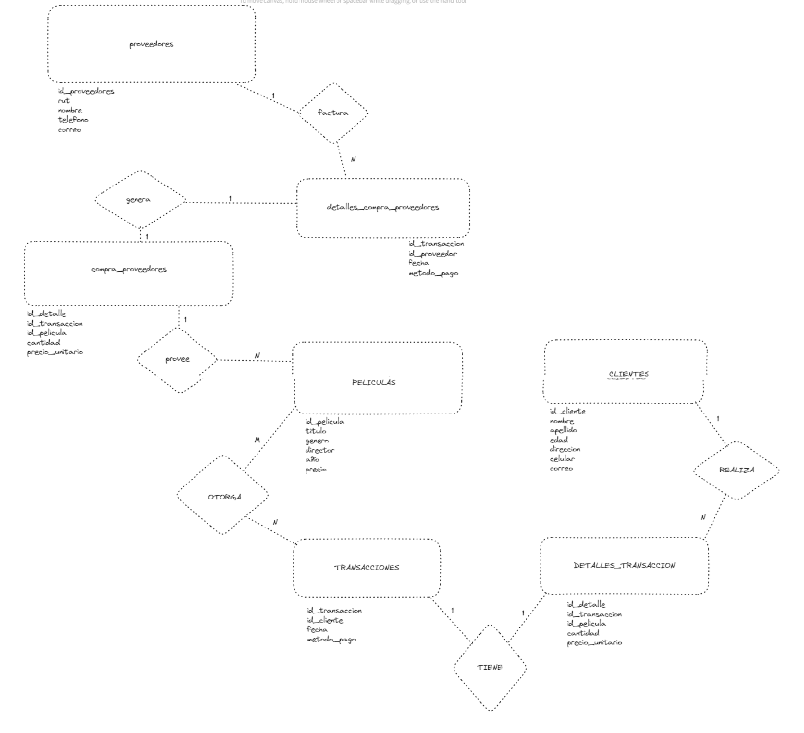

# 
Entrega de proyecto final

Alumno: Facundo Rodríguez

Comisión: 53180

Tutor: Carla Palermo Palermo

Tutor: Santiago Angel Gonzalez Martin

Docente: Anderson Michel TORRES

---

### **Consignas:**
- La base de datos debe contener al menos:
    * ~ 15 tablas, entre las cuales debe haber al menos 1 tabla de hechos,  2 tablas transaccionales.
    * ~ 5 vistas.
    * ~ 2 stored procedure.
    * ~ 2  trigger.
    * ~ 2 funciones
    
- El documento debe contener:
    - Introducción
    - Objetivo
    - Situación problemática
    - Modelo de negocio
    - Diagrama de entidad relació
    - Listado de tablas con descripción de estructura (columna,descripción, tipo de datos, tipo de clave)
    - Scripts de creación de cada objeto de la base de datos
    - Scripts de inserción de datos
    - Informes generados en base a la información de la base
    - Herramientas y tecnologías usadas

---

## Tematica del proyecto

La idea consiste en un negocio retro tipo venta de películas(VHS). Consistirá en base de películas
con detalles del año, productor, genero. A su vez habrá base de clientes donde se almacenarán
algunos datos como nombre, edad, entre otros datos personales. El servicio se dedicará
exclusivamente a la venta de títulos en VHS. También contempla la relación con proveedores,
ordenes de compra con ellos y dicho flujo. Se Presentaran tambien tabla sobre vendedores (funcionarios).

## Modelo de negocio

Como base se trata de un negocio de venta de VHS, donde un cliente podrá elegir dentro de un catalogo, dichos VHS son reventa de los proveedores mayoristas. Tambien se necesita un backup de cada registro de peliculas nuevo como auditoria y bases de clientes, proveedores y funcionarios.

## Diagrama entidad relacion (DER)

versionado anterior: 
https://github.com/esfacu/VENTAVHS/blob/proyecto-final/VENTAVHS%2BRODRIGUEZ.pdf

## Listado de tablas y descripcion

### Tabla: Peliculas

| Campo        | Tipo           | Permite NULL | Clave         |
|--------------|----------------|--------------|---------------|
| id_pelicula  | INT            | NO           | PK, AutoInc   |
| titulo       | VARCHAR(255)   | Sí           | -             |
| genero       | VARCHAR(100)   | Sí           | -             |
| director     | VARCHAR(100)   | Sí           | -             |
| año          | INT            | Sí           | -             |
| precio       | DECIMAL(10, 2) | Sí           | -             |

### Tabla: Auditoria_Peliculas

| Campo            | Tipo           | Permite NULL | Clave         |
|------------------|----------------|--------------|---------------|
| id_auditoria     | INT            | NO           | PK, AutoInc   |
| accion           | VARCHAR(100)   | Sí           | -             |
| id_pelicula      | INT            | Sí           | FK            |
| titulo_pelicula  | VARCHAR(255)   | Sí           | -             |
| genero_pelicula  | VARCHAR(100)   | Sí           | -             |
| director_pelicula| VARCHAR(100)   | Sí           | -             |
| año_pelicula     | INT            | Sí           | -             |
| precio_pelicula  | DECIMAL(10, 2) | Sí           | -             |
| fecha_hora       | TIMESTAMP      | Sí           | -             |

### Tabla: Clientes

| Campo    | Tipo         | Permite NULL | Clave         |
|----------|--------------|--------------|---------------|
| id_cliente| INT          | NO           | PK, AutoInc   |
| nombre   | VARCHAR(100) | Sí           | -             |
| apellido | VARCHAR(100) | Sí           | -             |
| edad     | INT          | Sí           | -             |
| direccion| VARCHAR(255) | Sí           | -             |
| celular  | VARCHAR(15)  | Sí           | -             |
| correo   | VARCHAR(100) | Sí           | -             |

### Tabla: Empleados

| Campo       | Tipo     | Permite NULL | Clave         |
|-------------|----------|--------------|---------------|
| id_vendedor | INT      | NO           | PK, AutoInc   |
| nombre      | VARCHAR(50) | Sí         | -             |
| fecha_ingreso | DATE    | Sí           | -             |
| telefono    | VARCHAR(15) | Sí          | -             |
| correo      | VARCHAR(100) | Sí          | -             |

### Tabla: Transacciones

| Campo        | Tipo         | Permite NULL | Clave         |
|--------------|--------------|--------------|---------------|
| id_transaccion| INT          | NO           | PK, AutoInc   |
| id_cliente   | INT          | Sí           | FK            |
| fecha        | DATE         | Sí           | -             |
| metodo_pago  | VARCHAR(50)  | Sí           | -             |
| estadotransacciones | BOOLEAN | Sí         | -             |

### Tabla: Detalles_Transaccion

| Campo        | Tipo         | Permite NULL | Clave         |
|--------------|--------------|--------------|---------------|
| id_detalle   | INT          | NO           | PK, AutoInc   |
| id_transaccion| INT         | Sí           | FK            |
| id_pelicula  | INT          | Sí           | FK            |
| cantidad     | INT          | Sí           | -             |
| precio_unitario | DECIMAL(10, 2) | Sí       | -             |
| id_vendedor  | INT          | Sí           | FK            |

### Tabla: Proveedores

| Campo         | Tipo     | Permite NULL | Clave         |
|---------------|----------|--------------|---------------|
| id_proveedor  | INT      | NO           | PK, AutoInc   |
| rut           | INT      | Sí           | -             |
| nombre        | VARCHAR(100) | Sí         | -             |
| telefono      | VARCHAR(15) | Sí          | -             |
| correo        | VARCHAR(100) | Sí          | -             |

### Tabla: Compra_Proveedores

| Campo        | Tipo         | Permite NULL | Clave         |
|--------------|--------------|--------------|---------------|
| id_transaccion| INT          | NO           | PK, AutoInc   |
| id_proveedor | INT          | Sí           | FK            |
| fecha        | DATE         | Sí           | -             |
| metodo_pago  | VARCHAR(50)  | Sí           | -             |

### Tabla: Detalles_Compra_Proveedores

| Campo        | Tipo         | Permite NULL | Clave         |
|--------------|--------------|--------------|---------------|
| id_detalle   | INT          | NO           | PK, AutoInc   |
| id_transaccion| INT         | Sí           | FK            |
| id_pelicula  | INT          | Sí           | FK            |
| cantidad     | INT          | Sí           | -             |
| precio_unitario | DECIMAL(10, 2) | Sí       | -             |

versiones anteriores:
https://github.com/esfacu/VENTAVHS/blob/proyecto-final/VENTAVHS%2BRODRIGUEZ.pdf

## Estructura e ingesta de datos

* Desde ultimo Commit la ingesta de datos se realiza desde la carpeta structure, archivo population.sql

documento versiones anteriores: 
https://github.com/esfacu/VENTAVHS/blob/proyecto-final/Paso%20a%20Paso%20Insercion%20Datos%20%2B%20Vistas%20Script.pdf

## Objetos de la base de datos

Los objetos de la base de datos se encuentra en carpeta objects, functions.sql, roles_users, store_procedures.sql, triggers.sql, views.sql 

Registro Pruebas Funciones,  ETC :
https://github.com/esfacu/VENTAVHS/blob/proyecto-final/Entrega2%2BRodriguez.pdf

+--------+------------+-------------------------+----------+-----------------+-------+
| nombre | apellido   | titulo                  | cantidad | precio_unitario | total |
+--------+------------+-------------------------+----------+-----------------+-------+
| Carlos | Gutiérrez | Back to the Future      |        1 |            9.99 |  9.99 |
| Ana    | Martínez  | The Breakfast Club      |        2 |           12.99 | 25.98 |
| Ana    | Martínez  | Raiders of the Lost Ark |        1 |           14.99 | 14.99 |
+--------+------------+-------------------------+----------+-----------------+-------+
+------------------+--------------------+----------+-----------------+-------+
| nombre_proveedor | titulo             | cantidad | precio_unitario | total |
+------------------+--------------------+----------+-----------------+-------+
| Proveedor Uno    | The Breakfast Club |        3 |            2.75 |  8.25 |
| Proveedor Dos    | Back to the Future |        4 |            3.00 | 12.00 |
+------------------+--------------------+----------+-----------------+-------+
+-----------------+-------------------------+-----------------+-------+-----------------+
| nombre_vendedor | titulo                  | precio_unitario | total | cantidad_ventas |
+-----------------+-------------------------+-----------------+-------+-----------------+
| Juan            | Back to the Future      |            9.99 |  9.99 |               1 |
| Raul            | The Breakfast Club      |           12.99 | 25.98 |               1 |
| Pedro           | Raiders of the Lost Ark |           14.99 | 14.99 |               1 |
+-----------------+-------------------------+-----------------+-------+-----------------+

+------------+---------------+------------------+--------------------+----------+-----------------+-------+
| fecha      | metodo_pago   | nombre_proveedor | titulo             | cantidad | precio_unitario | total |
+------------+---------------+------------------+--------------------+----------+-----------------+-------+
| 2024-03-23 | Tarjeta       | Proveedor Dos    | Back to the Future |        4 |            3.00 | 12.00 |
| 2024-03-22 | Transferencia | Proveedor Uno    | The Breakfast Club |        3 |            2.75 |  8.25 |
+------------+---------------+------------------+--------------------+----------+-----------------+-------+

## Roles y permisos

Roles : Administrador y Usuario
Permisos Administrador puede SELECT, INSERT, UPDATE, DELETE en toda la base.
Usuario solo puede SELECT en toda la base

## Back up de la base de datos

Existe backup de la db dentro de carpeta backups
También se puede generar un backup a través del comando make backup-db que permite ejecutar un backup de manera manual.

## Herramientas y tecnologias usadas
MySQL 
MySQL Workbench 
Visual Studio Code 
Makefile (interfaz de procesos)
Docker (container)
GitHub (entregar el proyecto)

## Como levantar el proyecto en CodeSpaces GitHub
* env: Archivo con contraseñas y data secretas
* Makefile: Abstracción de creacción del proyecto
* docker-compose.yml: Permite generar las bases de datos en forma de contenedores

#### Pasos para arrancar el proyecto

* En la terminal de linux escribir :
    - `make` _si te da un error de que no conexion al socket, volver al correr el comando `make`_
    - `make clean-db` limpiar la base de datos
    - `make test-db` para mirar los datos de cada tabla
    - `make backup-db` para realizar un backup de mi base de datos
    - `make access-db` para acceder a la base de datos

##### Entrega Proyecto Final:

https://github.com/esfacu/VENTAVHS/tree/proyecto-final
